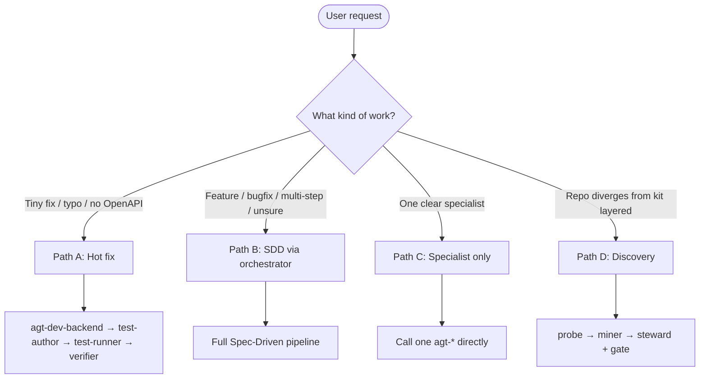
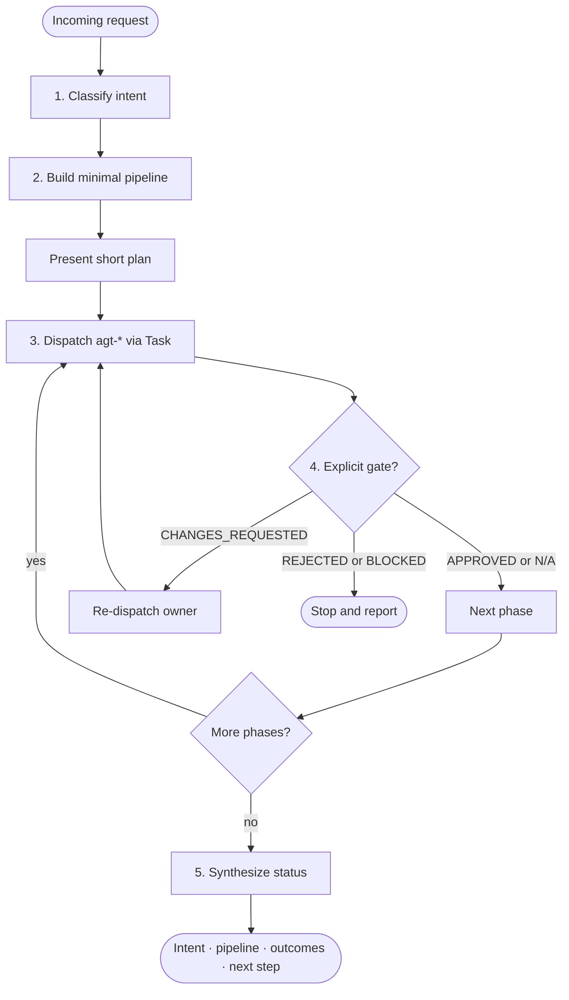
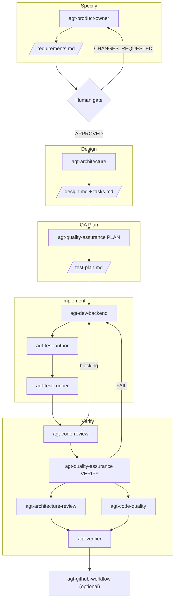
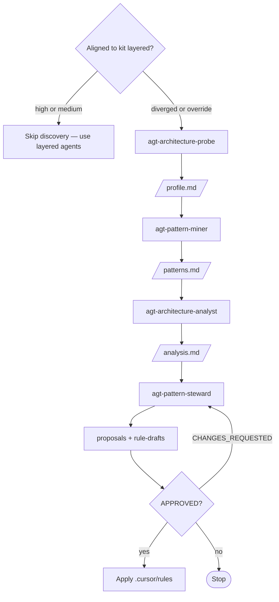
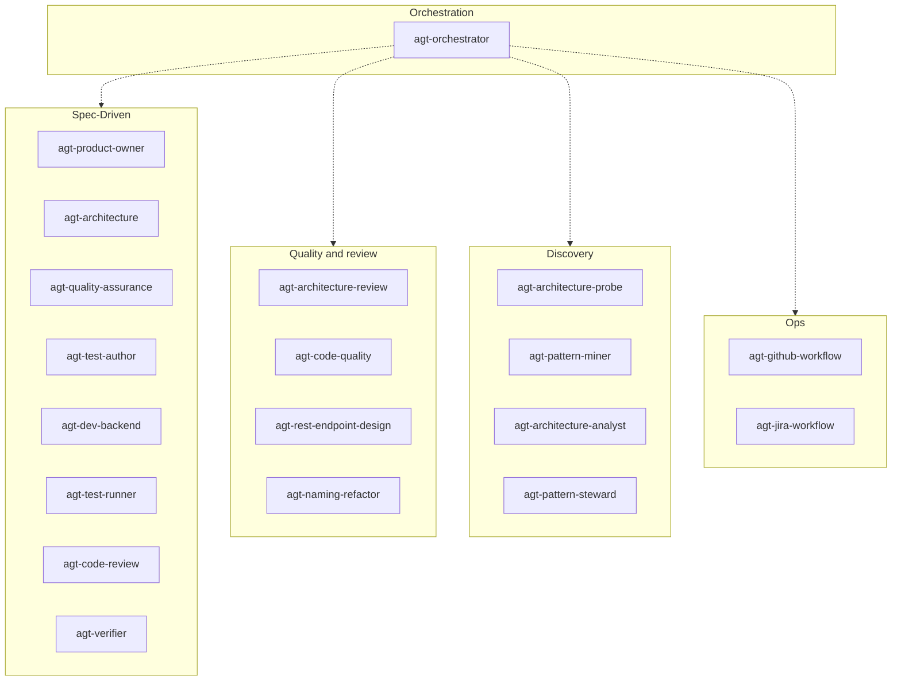

# ai-backend-kit

[](https://deepwiki.com/beardjs/ai-backend-kit)

Versioned AI kit for layered Node.js/TypeScript backends (Domain → Application → Infraestructure → Configuration).

This repository is **not a microservice**. It is the source of truth for independent Cursor (`.cursor`), Claude Code (`.claude`), and Codex (`.codex` + `.agents/skills`) kits plus the shared contracts that must be **replicated** into every backend service.

**npm:** [`@beardjs/ai-backend-kit`](https://www.npmjs.com/package/@beardjs/ai-backend-kit) (public)

Kit SemVer: [`VERSION`](VERSION) · [`package.json`](package.json) · changes: [`CHANGELOG.md`](CHANGELOG.md). After sync, services get `<kit-dir>/KIT_VERSION`.

## Contents

- [What this kit does](#what-this-kit-does)
- [Getting started](#getting-started)
- [Feature workflow](#feature-workflow)
- [Architecture discovery workflow](#architecture-discovery-workflow)
- [Three ways to work](#three-ways-to-work-in-a-service)
- [Agents and orchestration](#agents-and-orchestration)
- [What this repo contains](#what-this-repo-contains)
- [Principles](#principles)
- [Cursor kit indexes](#cursor-kit-indexes)
- [Claude Code kit](#claude-code-kit-claude)
- [Codex kit](#codex-kit-codex--agentsskills)
- [Kit version vs service release](#kit-version-vs-service-release)
- [Maintenance](#maintenance)

## What this kit does

`ai-backend-kit` is a **portable agent kit** for backends that follow a fixed layered architecture. You install it into **each service repository**; it does not replace that service’s `src/` or become a shared runtime.

When you sync the kit into a service, you get:

- **Architecture contracts** — Domain must not import Infraestructure; business rules live in Services (not Repository or Controller). Detail: [`AGENTS.md`](AGENTS.md) and [`docs/architecture-and-layers.md`](docs/architecture-and-layers.md).
- **Spec-Driven delivery** — features move through requirements → design → test plan → implementation → QA → verify, with explicit human gates.
- **Specialist agents** (`agt-*`) plus a thin **orchestrator** that routes multi-step work instead of doing everything in one thread.
- **Rules, skills, and hooks** for Cursor, Claude Code, and/or Codex — same pipeline, tool-native packaging.

What it does **not** do:

- Ship a runnable microservice or own your product code
- Store feature specs in this template repo — those live in the service under `docs/specs/<feature-slug>/`
- Auto-run a pipeline — you invoke an entry point (`agt-orchestrator`, `/orchestrate`, or Codex + `$spec-driven`)

## Getting started

Follow these steps in the **backend service** where you want the kit (not only in this template repo).

1. **Sync the kit** from the service repository root:

```bash
# First-time — opens interactive panel (↑↓ + Enter)
npx @beardjs/ai-backend-kit

# Non-interactive (CI / scripts)
npx @beardjs/ai-backend-kit -y --with-pr-template
npx @beardjs/ai-backend-kit --kit cursor --with-pr-template
npx @beardjs/ai-backend-kit --kit claude            # Claude Code kit
npx @beardjs/ai-backend-kit --kit codex             # Codex + repository skills
npx @beardjs/ai-backend-kit --kit cursor,claude,codex

# Optional: force / skip local architecture alignment scan after sync
npx @beardjs/ai-backend-kit -y --analyze-architecture
npx @beardjs/ai-backend-kit -y --no-analyze-architecture

# Pin for updates
yarn add -D @beardjs/ai-backend-kit
yarn ai-backend-kit
```

2. **Pick kit(s)** in the panel (or via `--kit`): Cursor, Claude Code, Codex, or a combination. Shared docs (`AGENTS.md`, architecture, spec templates, examples) always sync.
3. **Confirm install** — you should have `AGENTS.md`, `docs/architecture-and-layers.md`, and `<kit-dir>/KIT_VERSION` (e.g. `.cursor/KIT_VERSION`).
4. **Architecture scan (interactive panel)** — in the same install panel (right after choosing Cursor / Claude / Codex), the CLI asks whether to run a **local** kit-layered alignment scan after sync (no AI). On **first install** the default is **Yes** (question stays); later syncs default to No. Yes writes `docs/architecture/alignment-scan.md` and prints Path D next steps. Full narrative `analysis.md` comes from `agt-architecture-analyst` in the IDE. Use `--analyze-architecture` / `--no-analyze-architecture` in non-interactive runs.
5. **Open the IDE** on that service (Cursor, Claude Code, or Codex).
6. **Start your first feature** with the orchestrator entry for your tool (see [Feature workflow](#feature-workflow)). Describe the outcome in clear English.
7. **Legacy or foreign layout?** If the scan (or the service) does **not** already follow kit layered / [`examples/canonical-user/`](examples/canonical-user/), map it with [Architecture discovery workflow](#architecture-discovery-workflow) (**Path D**) before Spec-Driven delivery.
8. **At the requirements gate**, answer with an explicit decision — comments alone do not approve:

```text
APPROVED | CHANGES_REQUESTED | REJECTED | BLOCKED
```

**You’re ready when:**

- [ ] Kit files and `KIT_VERSION` are present in the service
- [ ] You know which entry to use (`agt-orchestrator` / `/orchestrate` / `$spec-driven`)
- [ ] You know that new features need an explicit `APPROVED` on `requirements.md` before code
- [ ] For a divergent/legacy repo, you know the Path D entry (`agt-architecture-probe` / `/architecture-discovery` / `architecture_discovery`)

Sync flags, overwrite vs preserve, and Claude/Codex specifics: [docs/ADOPTION.md](docs/ADOPTION.md).

Maintainer clone of this repo can still use `./scripts/sync-cursor.sh /path/to/service --kit cursor`.

## Feature workflow

Default path for a **new feature**, endpoint, context, or contract change (**Path B** — Spec-Driven). The orchestrator sequences specialists; you stay in the loop at gates.

| Step | Who | You do / you get |
|------|-----|------------------|
| 1. Idea | You → orchestrator | Describe the feature (and ask for end-to-end delivery) |
| 2. Requirements | `agt-product-owner` | `docs/specs/<slug>/requirements.md` |
| 3. Gate | **You** | Explicit `APPROVED` (or `CHANGES_REQUESTED` / …) |
| 4. Design | `agt-architecture` | `design.md` + `tasks.md` |
| 5. QA plan | `agt-quality-assurance` (PLAN) | `test-plan.md` **before** any product code |
| 6. Implement | `agt-dev-backend` → `agt-test-author` → `agt-test-runner` | Code under `src/` + Jest under `src/__tests__/` |
| 7. Review / verify | `agt-code-review` → QA VERIFY → `agt-verifier` | Typed findings + `qa-report.md` |
| 8. PR | `agt-github-workflow` | Commit / push / PR **only if you ask** |

Example prompt:

> Deliver feature X: \<short outcome, actors, constraints\>. Use the orchestrator end-to-end.

**Entry by tool:**

| Surface | Invoke |
|---------|--------|
| Cursor | [`agt-orchestrator`](.cursor/agents/agt-orchestrator.md) |
| Claude Code | [`/orchestrate`](.claude/skills/orchestrate/SKILL.md) |
| Codex | Primary agent + [`$spec-driven`](.agents/skills/ai-backend-kit-spec-driven/SKILL.md) |

Visual pipeline (artifacts, gates, feedback loops): [Feature pipeline (Spec-Driven)](#feature-pipeline-spec-driven).

Need something smaller? Use **Path A** (hot fix) or **Path C** (one specialist) in the table below — no full Spec-Driven loop.

## Architecture discovery workflow

**Path D** — map a repository **as-is** before (or instead of) assuming kit layered conventions. Run when alignment to kit layered / [`examples/canonical-user/`](examples/canonical-user/) is below medium, or when you **explicitly override**. If the service already matches that layered shape, discovery is **skipped** (`SKIPPED_LAYERED_KIT`) — use `agt-architecture` / `agt-architecture-review` and existing kit rules instead.

| Step | Who | You do / you get |
|------|-----|------------------|
| 1. Alignment check | Entry (orchestrator / skill) | `high` / `medium` → skip; diverged or override → continue |
| 2. Profile | `agt-architecture-probe` | `docs/architecture/profile.md` (style, boundaries, dependencies) |
| 3. Patterns | `agt-pattern-miner` | `docs/architecture/patterns.md` (recurring practices + evidence) |
| 4. Consolidate | `agt-architecture-analyst` | `docs/architecture/analysis.md` (single narrative over profile + patterns) |
| 5. Stewardship | `agt-pattern-steward` | `proposals.md` + `rule-drafts/` (optional; only if you want standards) |
| 6. Gate | **You** | Explicit `APPROVED` before any kit rules are written |

Example prompts:

```text
Map this repository architecture as-is (Path D). Profile boundaries and mine recurring patterns.

Run architecture discovery anyway (explicit override), even if the repo looks kit-layered.
```

Recognized override phrases include: `run the probe anyway`, `run architecture discovery anyway`, `explicit override`.

**Entry by tool:**

| Surface | Invoke |
|---------|--------|
| Cursor | [`agt-orchestrator`](.cursor/agents/agt-orchestrator.md) (intent `discover-architecture`) **or** [`agt-architecture-probe`](.cursor/agents/agt-architecture-probe.md) directly |
| Claude Code | [`/architecture-discovery`](.claude/skills/architecture-discovery/SKILL.md) |
| Codex | Agent [`architecture_discovery`](.codex/README.md) / [`$architecture-discovery`](.agents/skills/ai-backend-kit-architecture-discovery/SKILL.md) |

Detail and routing: [`.cursor/ARCHITECTURE-DISCOVERY.md`](.cursor/ARCHITECTURE-DISCOVERY.md) · diagram: [Architecture discovery](#architecture-discovery).

## Three ways to work (in a service)

| Path | When | Entry |
|------|------|--------|
| **A — Hotfix / typo** | Rename, 1-liner, or ≤3 files with no OpenAPI/route change | Specialist agent directly (`agt-dev-backend` → `agt-test-author` if needed → `agt-test-runner` → `agt-verifier`) |
| **B — Feature (SDD)** | New endpoint/context or contract change | **`agt-orchestrator`** (Cursor) / **`/orchestrate`** (Claude Code) / primary Codex agent + `$spec-driven` — PO → human gate → design → QA plan → … |
| **C — Specialist only** | Requirements only, design only, review only, PR only | Call that agent (`agt-product-owner`, `agt-code-review`, `agt-github-workflow`, …) |
| **D — Architecture discovery** | Repo **diverges** from kit layered / [`examples/canonical-user/`](examples/canonical-user/) (or explicit override) | [Architecture discovery workflow](#architecture-discovery-workflow) — probe → miner → analyst → steward + gate — [ARCHITECTURE-DISCOVERY.md](.cursor/ARCHITECTURE-DISCOVERY.md) |

Shortcuts detail: [`.cursor/WORKFLOW.md`](.cursor/WORKFLOW.md) / [`.claude/WORKFLOW.md`](.claude/WORKFLOW.md).

## Agents and orchestration

Specialist agents (`agt-*`) are **opt-in**. The kit does not run a pipeline by itself — you invoke an entry point, and specialists collaborate under explicit gates.

| Surface | Default entry for features / multi-step work |
|---------|----------------------------------------------|
| Cursor | [`agt-orchestrator`](.cursor/agents/agt-orchestrator.md) |
| Claude Code | [`/orchestrate`](.claude/skills/orchestrate/SKILL.md) |
| Codex | Primary agent + [`$spec-driven`](.agents/skills/ai-backend-kit-spec-driven/SKILL.md) |

Full pipeline reference: [`.cursor/WORKFLOW.md`](.cursor/WORKFLOW.md). Agent definitions: [`.cursor/agents/`](.cursor/agents/).

### Which path?

Pick a path from the request shape. Paths A/C skip full Spec-Driven; path D runs only when the repo is **not** aligned with the kit layered shape (or you override).



### How the orchestrator works

[`agt-orchestrator`](.cursor/agents/agt-orchestrator.md) is a **thin router**. It **classifies**, **routes**, **sequences**, and **reports**. It does **not**:

- edit `src/` or write specs itself
- replace deep review, QA, or verification
- commit, open PRs, or create Jira issues without an explicit user request
- run architecture discovery when the repo already matches kit layered / canonical-user



**Intents** the orchestrator may classify:

| Intent | Meaning |
|--------|---------|
| `specify` | Spec / requirements only |
| `feature` | New behavior (full SDD by default) |
| `bugfix` | Correct broken behavior (hot-fix short-circuit when tiny) |
| `review` | Audit without implementing |
| `discover-architecture` | As-is profile / pattern mine / rule stewardship — only if diverged (or override) |
| `test-only` | Create coverage or stabilize suite |
| `qa-only` | Acceptance against an existing spec |
| `jira` | Issue read / create |
| `release` | Commit / PR after work exists |

**Gates** use a closed vocabulary. Comments, praise, or “please revise” do **not** change state:

```text
APPROVED | CHANGES_REQUESTED | REJECTED | BLOCKED
```

Sensitive stops include: new `requirements.md`, applying discovery rules to `.cursor/rules/`, Jira create, and git commit / push / PR.

### Feature pipeline (Spec-Driven)

Default path **B**. Principle: **shift-left** — `requirements.md` → `design.md` → `test-plan.md` exist **before** `agt-dev-backend`. Artifacts live under `docs/specs/<feature-slug>/`.



Blocking code-review findings and QA `FAIL` return to `agt-dev-backend`. `PASS_WITH_RISKS` requires explicit human risk acceptance before release. GitHub workflow runs only when requested.

### Architecture discovery

Path **D**. Steps, Entry by tool, and copy-paste prompts: [Architecture discovery workflow](#architecture-discovery-workflow). Detail: [`.cursor/ARCHITECTURE-DISCOVERY.md`](.cursor/ARCHITECTURE-DISCOVERY.md).



### Agent map

Cursor names below are canonical. Claude Code and Codex expose the same roles (Claude under `.claude/agents/`; Codex consolidates into fewer custom agents).



| Group | Agent | Role |
|-------|-------|------|
| Orchestration | [`agt-orchestrator`](.cursor/agents/agt-orchestrator.md) | Classifies intent, builds a minimal pipeline, enforces gates, synthesizes status |
| Spec-Driven | [`agt-product-owner`](.cursor/agents/agt-product-owner.md) | Turns vague requests into versioned, testable `requirements.md` |
| Spec-Driven | [`agt-architecture`](.cursor/agents/agt-architecture.md) | Writes technical `design.md` (+ tasks) from approved requirements — no `src/` edits |
| Spec-Driven | [`agt-quality-assurance`](.cursor/agents/agt-quality-assurance.md) | PLAN (`test-plan.md`) before code; VERIFY (`qa-report.md`) after — does not write Jest |
| Spec-Driven | [`agt-test-author`](.cursor/agents/agt-test-author.md) | Creates / extends Jest unit and integration tests under `src/__tests__/` |
| Spec-Driven | [`agt-dev-backend`](.cursor/agents/agt-dev-backend.md) | Implements the approved slice in the layered Node.js/TypeScript backend |
| Spec-Driven | [`agt-test-runner`](.cursor/agents/agt-test-runner.md) | Runs, diagnoses, and stabilizes failing Jest suites |
| Spec-Driven | [`agt-code-review`](.cursor/agents/agt-code-review.md) | Spec ↔ code review with typed findings — read-only |
| Spec-Driven | [`agt-verifier`](.cursor/agents/agt-verifier.md) | Skeptical delivery gate: wiring, contracts, tests, lint, evidence |
| Quality | [`agt-architecture-review`](.cursor/agents/agt-architecture-review.md) | Post-code layered architecture audit — read-only |
| Quality | [`agt-code-quality`](.cursor/agents/agt-code-quality.md) | Naming, REST conventions, and light layer checks |
| Quality | [`agt-rest-endpoint-design`](.cursor/agents/agt-rest-endpoint-design.md) | Deep REST / OpenAPI design review for Express + `service.yaml` |
| Quality | [`agt-naming-refactor`](.cursor/agents/agt-naming-refactor.md) | Read-only naming review and ordered rename suggestions |
| Discovery | [`agt-architecture-probe`](.cursor/agents/agt-architecture-probe.md) | As-is architecture profile for any style → `profile.md` |
| Discovery | [`agt-pattern-miner`](.cursor/agents/agt-pattern-miner.md) | Mines recurring practices with evidence → `patterns.md` |
| Discovery | [`agt-architecture-analyst`](.cursor/agents/agt-architecture-analyst.md) | Consolidates profile + patterns → `analysis.md` |
| Discovery | [`agt-pattern-steward`](.cursor/agents/agt-pattern-steward.md) | Proposes rules; writes `.cursor/rules/` only after `APPROVED` |
| Ops | [`agt-github-workflow`](.cursor/agents/agt-github-workflow.md) | Conventional commits and PR creation — explicit request only |
| Ops | [`agt-jira-workflow`](.cursor/agents/agt-jira-workflow.md) | Read / create Jira issues — explicit request only |

Skills that back these agents are indexed in [`.cursor/SKILLS.md`](.cursor/SKILLS.md).

## What this repo contains

| Path | Role |
|------|------|
| [`.cursor/`](.cursor/) | Cursor kit — rules, agents, skills, hooks, and indexes (`RULES.md`, `WORKFLOW.md`, …) |
| [`.claude/`](.claude/) | Claude Code kit — `CLAUDE.md`, path-scoped rules, subagents, skills, hooks + `settings.json` ([index](.claude/README.md)) |
| [`.codex/`](.codex/) | Codex kit — project config, nine custom agents, hooks, execpolicy, and index ([README](.codex/README.md)) |
| [`.agents/skills/`](.agents/skills/) | Codex-native repository skills (progressive disclosure) |
| [`AGENTS.md`](AGENTS.md) | Short backend contract (commands, layers, DoD) |
| [`docs/architecture-and-layers.md`](docs/architecture-and-layers.md) | Layer detail and boundaries |
| [DeepWiki](https://deepwiki.com/beardjs/ai-backend-kit) | Auto-generated explorable wiki for this public kit repo (steered by [`.devin/wiki.json`](.devin/wiki.json)) |
| [`docs/specs/_templates/`](docs/specs/_templates/) | Spec-Driven templates (`requirements`, `design`, `tasks`, `test-plan`, `qa-report`) |
| [`docs/ADOPTION.md`](docs/ADOPTION.md) | How to adopt / sync into a service |
| [`docs/templates/PULL_REQUEST_TEMPLATE.md`](docs/templates/PULL_REQUEST_TEMPLATE.md) | Optional PR template seed for services |
| [`examples/canonical-user/`](examples/canonical-user/) | Illustrative `user` context (not a runnable app) |
| [`bin/ai-backend-kit.js`](bin/ai-backend-kit.js) | npm CLI entry (`npx` / `yarn ai-backend-kit`) |
| [`lib/sync-kit.js`](lib/sync-kit.js) | Sync implementation (Node, no rsync) |
| [`scripts/sync-cursor.sh`](scripts/sync-cursor.sh) | Maintainer alternative (bash + rsync) |

## Principles

- **Generic and replicable** — the same kit applies to any service that follows the layered architecture.
- **Do not strip detail** — rules, agents, and skills stay complete; what changes per service is only `src/` code and that service’s feature specs.
- **Canonical examples** — snippets using the `user` context (`UserService`, `IUser`, …) are the **pedagogical pattern** of the kit, not a coupling to one service. In real code, use the service’s `<context>`. See [`examples/canonical-user/`](examples/canonical-user/).
- **Fixed spelling** — folders `infraestructure` (with “e”) and `configuration` (singular).
- **English only** — all kit docs, rules, agents, and skills are written in English.

## Cursor kit indexes

| Doc | Purpose |
|-----|---------|
| [`.cursor/RULES.md`](.cursor/RULES.md) | Rules index |
| [`.cursor/WORKFLOW.md`](.cursor/WORKFLOW.md) | Idea → release-gate pipeline |
| [`.cursor/SPECS.md`](.cursor/SPECS.md) | Spec-Driven toolkit |
| [`.cursor/SKILLS.md`](.cursor/SKILLS.md) | Skills map (scaffold / SDD / review / ops) |
| [`.cursor/ARCHITECTURE-DISCOVERY.md`](.cursor/ARCHITECTURE-DISCOVERY.md) | Agnostic probe / miner / steward (Path D) |
| [`.cursor/QUALITY.md`](.cursor/QUALITY.md) | Naming / REST / audits |
| [`.cursor/GITHUB.md`](.cursor/GITHUB.md) | Commits and PRs |
| [`.cursor/JIRA.md`](.cursor/JIRA.md) | Jira issues (org defaults) |

## Claude Code kit (`.claude/`)

Native port of the same pipeline, optimized for Claude Code:

- [`CLAUDE.md`](.claude/CLAUDE.md) — lean project memory importing `AGENTS.md`
- [`README.md`](.claude/README.md) — kit index (rules / agents / skills / quality / ops)
- [`WORKFLOW.md`](.claude/WORKFLOW.md) — idea → release-gate pipeline (`/orchestrate` entry)
- `rules/` — path-scoped rules that load only when Claude touches matching files
- `agents/` — 17 subagents with tiered models (`haiku` / `sonnet` / `inherit`) and per-role tool restrictions
- `skills/` — 19 skills (directory name = `/command`; manual ones use `disable-model-invocation`)

## Codex kit (`.codex/` + `.agents/skills/`)

- [`config.toml`](.codex/config.toml) — project-scoped multi-agent configuration with a three-subagent cap and inherited models
- [`agents/`](.codex/agents/) — nine consolidated roles with per-role reasoning and sandbox boundaries
- [`hooks.json`](.codex/hooks.json) + `rules/` — trusted-project guardrails for sensitive files and destructive commands
- [`.agents/skills/`](.agents/skills/) — 18 focused workflows discovered natively and loaded progressively
- [`README.md`](.codex/README.md) — agent map, trust setup, and default delivery flow

## Kit version vs service release

| Concern | Mechanism |
|---------|-----------|
| This kit (npm) | **semantic-release** on push to `main` (see [`.github/workflows/release.yml`](.github/workflows/release.yml)) → updates `VERSION` / `package.json` / `CHANGELOG.md`, publishes, stamps as `<kit-dir>/KIT_VERSION` after sync |
| Service npm package | semantic-release in the **service** ([`rule.release.mdc`](.cursor/rules/rule.release.mdc) / [`release.md`](.claude/rules/release.md)) |

## Maintenance

1. Evolve rules/agents/skills **in this** repository.
2. Open a PR with **Conventional Commits** (no AI attribution). Do **not** bump `VERSION` / `package.json` / `CHANGELOG.md` by hand.
3. Merge to **`main`** — GitHub Actions runs semantic-release: changelog, version bump, npm publish, git tag, GitHub Release (requires secret `NPM_TOKEN`).
4. Services then run `yarn up @beardjs/ai-backend-kit && yarn ai-backend-kit`.

---

Developed by [Filipe Paixão](https://github.com/FilipePaixao).
